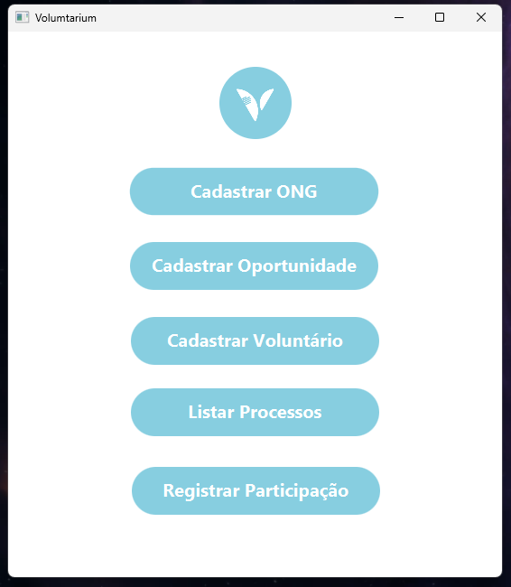

<h1 align='center'>Volumtarium</h1> 

    
    
    

Volumtarium é uma aplicação desenvolvida em Java com o objetivo de conectar ONGs e voluntários de forma eficiente.
    Este projeto permite que ONGs se cadastrem, detalhem suas áreas de atuação, e publiquem oportunidades de trabalho voluntário. 
    Voluntários podem buscar oportunidades com base em seu perfil ou localização, garantindo uma conexão rápida e precisa.

<h2>Funcionalidades</h2>
<ul>
    <li>Cadastro de ONGs: Permite que as ONGs insiram informações detalhadas sobre suas áreas de atuação.</li>
    <li>Busca por Voluntários: Os voluntários podem pesquisar por oportunidades de trabalho de acordo com suas preferências e localização.</li>
    <li>Inscrição e Contato Direto: Funcionalidades para facilitar o contato entre ONGs e voluntários.</li>
</ul>

<h2>Tecnologias Utilizadas</h2>
<ul>
    <li>Java</li>
    <li>JUnit (para testes de unidade)</li>
    <li>JavaFX e Scene Builder (para interface gráfica)</li>
</ul>

<h2>Layout do Projeto</h2>

<h2>Autores</h2>
<ul>
    <li><a href="https://github.com/henriiqueaze/" target="_blank">Henrique Azevedo</a> - Interface Gráfica</li>
    <li><a href="https://github.com/thiagoports/" target="_blank">Thiago Porto</a> - Classes</li>
    <li><a href="https://github.com/JoseLucasapp/" target="_blank">José Lucas</a> - Testes Unitários</li>
    <li><a href="https://github.com/ArthurAkil/" target="_blank">Arthur Akill</a> - Tratamento de Exceções</li>
</ul>

